# Project 1 - Identifying lane lines on the road
The goal of this project was to develop a pipeline that precisely and efficiently identifies lane lines on the road.


The methods utilized in developing this lane marking system:
* Color Selection
* Region of Interest Masking
* Canny Edge Detection
* Hough Transform Line

These techniques were first tested on a set of static images, then applied to video of a moving car.

## Import dependencies and load test images


```python
import matplotlib.pyplot as plt
import cv2
import os, glob
import numpy as np
from moviepy.editor import VideoFileClip

%matplotlib inline
%config InlineBackend.figure_format = 'retina'
```

Lets define our function to display loaded images.


```python
def display_images(images,cmap=None):
    cols=3
    rows=(len(images)+1)//cols # the "//" returns a whole number
    
    plt.figure(figsize=(15,5))
    for i, image in enumerate(images):
        plt.subplot(rows,cols,i+1)
        # use grayscale if the image only has one channel
        cmap='gray' if len(image.shape)==2 else cmap
        plt.imshow(image,cmap=cmap)
        plt.xticks([])
        plt.yticks([])
    plt.tight_layout(pad=0,h_pad=0,w_pad=0)
    plt.show()
```

Load and display images.


```python
test_images = [plt.imread(path) for path in glob.glob('test_images/*.jpg')]

display_images(test_images)
```


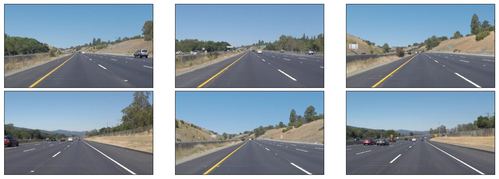


## Lane Marking Color Selection
Functions used in this section are:
* `np.uint8()` – array of unsigned integer (0 to 255) type
* `cv2.inRange()` – omits everything outside the lower and upper thresholds for a given array
* `cv2.bitwise_or()` – computes the per-element bit-wise disjunction of two arrays or an array and a scalar.
* `cv2.bitwise_and()` – computes the per-element bit-wise conjunction of two arrays or an array and a scalar.

### RGB Color Space
The images are currently set to the RGB color space, which may have its downfalls. Let's try selecting the white and yellow lane markngs on the road to test it out.


```python
# selects white and yellow lane marking for an RGB image
def select_rgb_wy(image):
    # white color mask
    lower = np.uint8([200,200,200])
    upper = np.uint8([255,255,255])
    white_mask = cv2.inRange(image, lower, upper) # inRange() function returns RGB rows that are within upper/lower thresholds of an array
    
    # yellow color mask
    lower = np.uint8([175,185,0])
    upper = np.uint8([255,255,255])
    yellow_mask = cv2.inRange(image, lower, upper)
    
    # combine the two masks
    mask = cv2.bitwise_or(white_mask,yellow_mask)
    
    # impose combined mask onto image
    imposed = cv2.bitwise_and(image,image,mask=mask)
    
    return imposed

display_images(list(map(select_rgb_wy,test_images)))
```


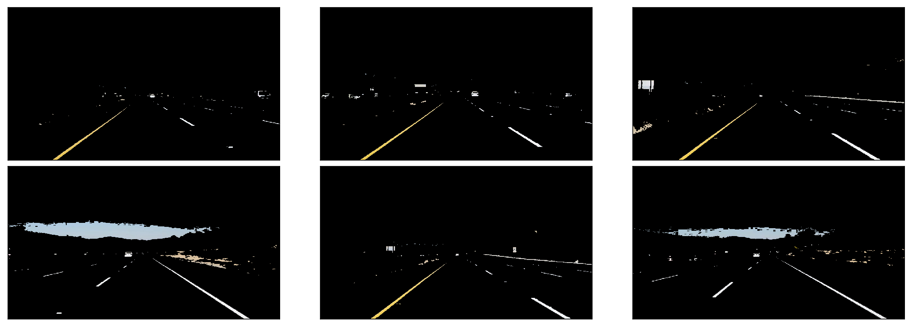


Our results aren't bad but let's also try converting our RGB to a slightly different color space.

### HSL Color Space
HSL represents the hue, saturation, and light properties of an image.
>Hue is a degree on the color wheel (from 0 to 360) - 0 (or 360) is red, 120 is green, 240 is blue. Saturation is a percentage value; 0% means a shade of gray and 100% is the full color. Lightness is also a percentage; 0% is black, 100% is white.
>https://www.w3schools.com/cssref/css_colors_legal.asp

Using the `cvtColor` function and the `COLOR_RGB2HSL` method from cv2, we're able to convert the color space of an RGB image to an HSL.


```python
def rgb_to_hsl(image):
    return cv2.cvtColor(image,cv2.COLOR_RGB2HLS)

display_images(list(map(rgb_to_hsl,test_images)))
```


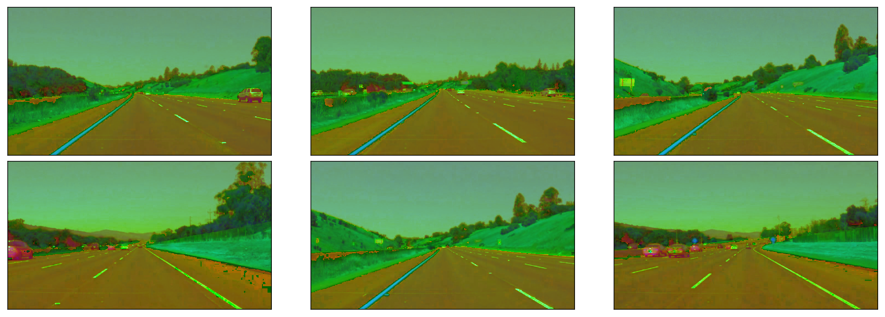


### Lane Color Selection
Let's build a function that will first convert our image from an RGB to an HSL, then select our lane markings


```python
def select_lane_lines(image):
    hsl_image = rgb_to_hsl(image)
    
    # white color mask
    lower = np.uint8([0,200,0])
    upper = np.uint8([255,255,255])
    white_mask = cv2.inRange(hsl_image,lower,upper)
    
    # yellow color mask
    lower = np.uint8([15,10,110])
    upper = np.uint8([40,255,255])
    yellow_mask = cv2.inRange(hsl_image,lower,upper)
    
    # combine masks
    mask = cv2.bitwise_or(white_mask,yellow_mask)
    
    # impose combined mask onto image
    imposed = cv2.bitwise_and(image,image,mask=mask)
    
    return imposed

wy_lane_lines = list(map(select_lane_lines,test_images))
display_images(wy_lane_lines)
```


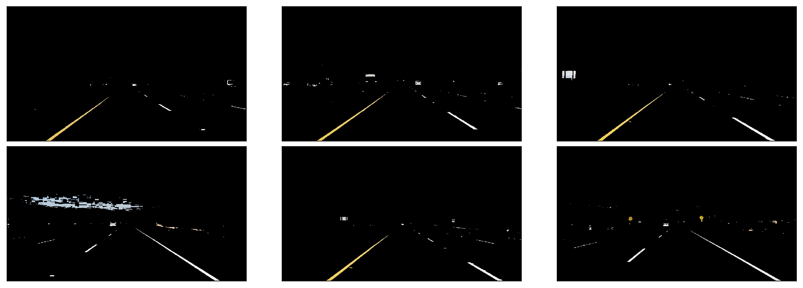


### Grayscale Lane Color Conversion
We can now convert our white and yellow lane markings to a grayscale color space.


```python
def rgb_to_gray(image):
    return cv2.cvtColor(image,cv2.COLOR_RGB2GRAY)

gray_lane_lines = list(map(rgb_to_gray,wy_lane_lines))
display_images(gray_lane_lines)
```


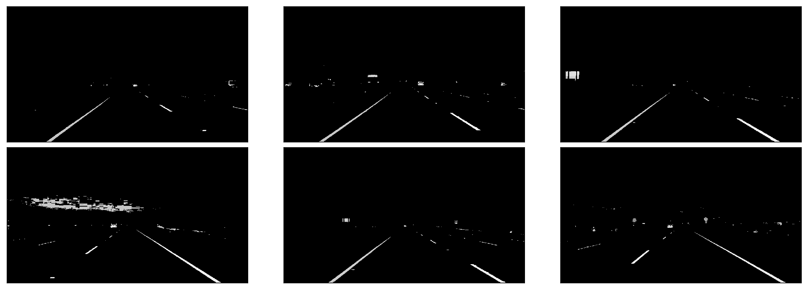


## Edge Detection
Before applying any edge detection algorithm, it is pertinent that we remove the noise in the image.

### Gaussian Blur
We apply a gaussian blur using cv2's `GaussianBlur` function.


```python
def gaussian_blur(image, kernel_size=17):
    # make sure kernal_size value is a positive-odd number
    return cv2.GaussianBlur(image,(kernel_size,kernel_size),0)

blur_lanes = list(map(gaussian_blur,gray_lane_lines))
display_images(blur_lanes)
```


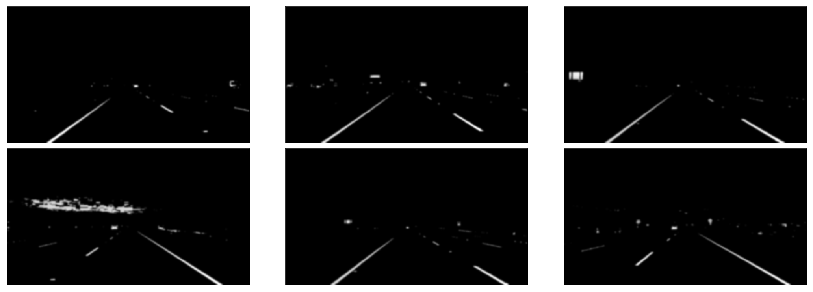


### Canny Edge Detection
We can apply our canny edge detection algorithm using cv2's `Canny` function with the appropriate parameters.

Wikipedia explains the conecpt of edge detection as follows:
>Edge detection includes a variety of mathematical methods that aim at identifying points in a digital image at which the image brightness changes sharply or, more formally, has discontinuities.

>https://en.wikipedia.org/wiki/Edge_detection

Basically, algorithms like Canny calculate the pixel gradient across the image and look for rapid changes in the color to determine where the edges are.

The `Canny` function contians two threshold arguments that are used to identify the upper and lower gradient bounds. 
* High Threshold - if the pixel gradient is above the upper threshold then it's accepted as an edge
* Low Threshold - if the pixel gradient is below the lower threshold then it's accepted as an edge
* Gradients that lie between low/high thresholds are classified edges or non-edges depending on their connectivity. If they are connected to "sure-edge" pixels (gradient value > high threshold), they are considered to be part of edges. Otherwise, they are discarded.
* Canny recommends an upper:lower ratio range between 2:1 and 3:1. Experiment for best results.


```python
def canny_edge_detection(image,low_threshold=10,high_threshold=150):
    return cv2.Canny(image,low_threshold,high_threshold)

lane_edges = list(map(canny_edge_detection, blur_lanes))
display_images(lane_edges)
```


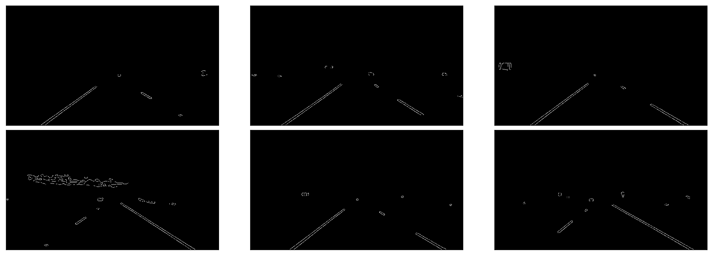


## Region of Interest (ROI) Selection
Defining the region of interest will help us narrow down pertinent information in a given image. This ROI will be shaped like a trapezoid, which looks something like this:
(ENTER IMAGE HERE)

We'll be utilizing the `cv2.fillPoly()` function to mask a specified region of an image.


```python
def apply_poly(image,vertices):
    mask = np.zeros_like(image)
    if len(mask.shape)==2:
        cv2.fillPoly(mask,vertices,255) # applies fillPoly on the mask object using the vertices provided
    else:
        cv2.fillPoly(mask,vertices,(255,)*mask.shape[2])
    return cv2.bitwise_and(image,mask)

def select_roi(image,bottom_x_adj=0.1,top_x_adj=0.4,top_y=0.6):
    ysize, xsize = image.shape[:2]
    bottom_left = [xsize*bottom_x_adj,ysize]
    bottom_right = [xsize*(1-bottom_x_adj),ysize]
    top_left = [xsize*top_x_adj,ysize*top_y]
    top_right = [xsize*(1-top_x_adj),ysize*top_y]
    
    vertices = np.array([[bottom_left, top_left, top_right, bottom_right]],dtype=np.int32)
    return apply_poly(image,vertices)

select_roi_list = list(map(select_roi,lane_edges))
display_images(select_roi_list)
```


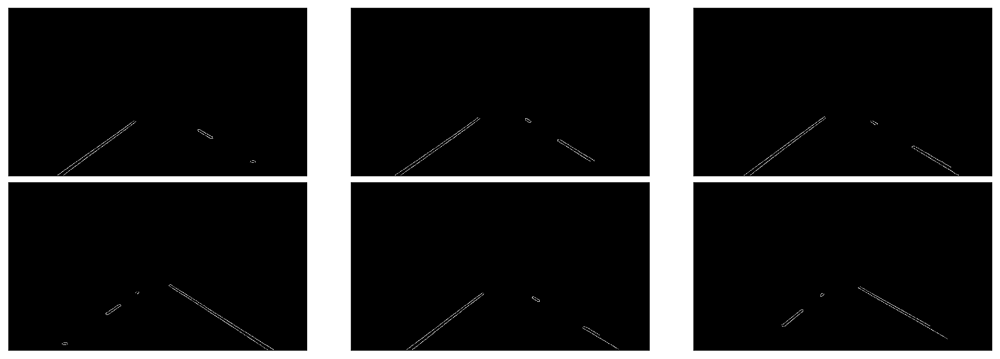


## Hough Transform for Line Detection
The Hough Transform is a feature extraction technique used to determine where the lines are in the image.

We're able to apply this technique using the `cv2.HoughLinesP` function and the following input parameters:
* rho – perpendicular distance from origin to the line
* theta – angle formed by the perpendicular line and horizontal axis measured in counter-clockwise
* threshold – accumulator threshold parameter. Only lines within threshold constraints are accepted
* minLineLength – line segments shorter than this value are rejected
* maxLineGap – max gap distance between two points to be considered a line

A line in parameteric form can be illustrated as rho=xcos(theta)+ysin(theta)

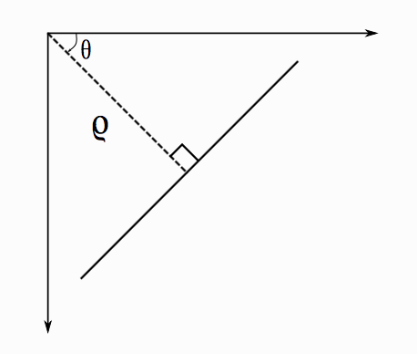

Let's define our Hough Transform function and display the results onto our `test_images`.


```python
def hough_transform(image):
    return cv2.HoughLinesP(image,rho=1,theta=np.pi/180,threshold=20,minLineLength=20,maxLineGap=300)

hough_lines_list = list(map(hough_transform,select_roi_list))
```

`hough_lines` contains all the lines that were detected in each given image. 

Let's impose those lines onto the original images.


```python
def draw_lane_lines(image,lines,color=[255,0,0],thickness=2,copy_image=True):
    if copy_image:
        image = np.copy(image)
    for line in lines:
        for x1,y1,x2,y2 in line:
            cv2.line(image,(x1,y1),(x2,y2),color,thickness)
    return image

draw_lines = list(map(draw_lane_lines,test_images,hough_lines_list))
display_images(draw_lines)
```


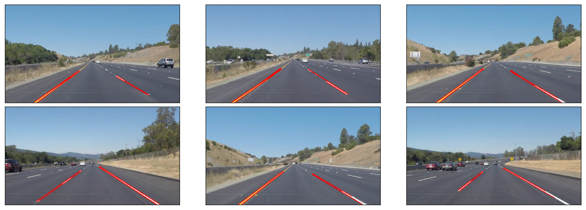


### Extrapolating Lines
As we can see, while outside lanes have a well-defined line, the inner lanes don't. So let's extrapolate a full line over the shorter lines. There's also multiple lines detected in each of our left and right lanes. We can find a single left and right lane line by averaging these lines using their slope and intercept values.

Note: The y-coordinate is reversed.


```python
def avg_slope_intercept(lines):
    left_lines = [] # [(slope, intercept),...]
    left_weights = [] # [length,...]
    right_lines = [] # [(slope, intercept),...]
    right_weights = [] # [length,...]
    
    for line in lines:
        for x1,y1,x2,y2 in line:
            length = np.sqrt((x2-x1)**2+(y2-y1)**2)
            slope = (y2-y1)/(x2-x1)
            intercept = y1 - slope * x1
            
            if slope < 0:
                left_lines.append((slope,intercept))
                left_weights.append(length)
            else:
                right_lines.append((slope,intercept))
                right_weights.append(length)
    
    left_lane_line = np.dot(left_weights,left_lines)/np.sum(left_weights) if len(left_weights) > 0 else None
    right_lane_line = np.dot(right_weights,right_lines)/np.sum(right_weights) if len(right_weights) > 0 else None
    
    return left_lane_line, right_lane_line

avg_slope_int_lane_lines = list(map(avg_slope_intercept,hough_lines_list))
```

Using the `avg_slope_intercept` function we can determine the average of the left/right lane lines and return the slope and intercept of each `test_image`.

Now that we know what our slope and intercept for our two lane lines, let's create a function to draw it onto our image.


```python
def draw_two_lanes(image,lane_lines,color=[255,0,0],thickness=12):
    y1=image.shape[0]
    y2=y1*0.6
    
    lane_image = np.zeros_like(image)
    for line in lane_lines:
        slope = line[0]
        intercept = line[1]
        x1 = int((y1 - intercept)/slope)
        x2 = int((y2 - intercept)/slope)
        y1 = int(y1)
        y2 = int(y2)
        cv2.line(lane_image,(x1,y1),(x2,y2),color,thickness)
        
    return cv2.addWeighted(image,1,lane_image,0.9,0)

lane_line_images = list(map(draw_two_lanes,test_images,avg_slope_int_lane_lines))
display_images(lane_line_images)
```


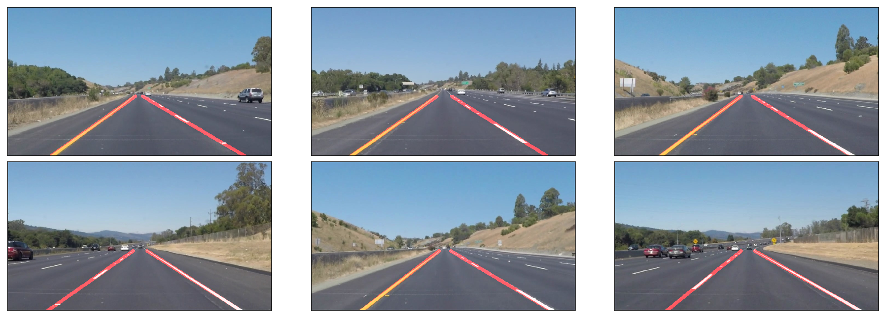


## Identifying Lanes in Video
Let's test the lane marking pipeline that we developed to see how it performs on video clips.


```python
from collections import deque

QUEUE_LENGTH=50
FRAME_LENGTH=30 # number of most recent frames we'd like to evaluate

class FindLanes:
    def __init__(self):
        self.left_lanes = deque(maxlen=QUEUE_LENGTH)
        self.right_lanes = deque(maxlen=QUEUE_LENGTH)
        self.lane_smoothing = False
        self.slope_int_memory = []
        
    def process(self,image):
        mask_lanes = select_lane_lines(image)
        gray_lanes = rgb_to_gray(mask_lanes)
        blur_lanes = gaussian_blur(gray_lanes)
        canny_lanes = canny_edge_detection(blur_lanes)
        roi = select_roi(canny_lanes)
        hough_lines = hough_transform(roi)
        avg_slope_int_lane_lines = avg_slope_intercept(hough_lines)
        
        # calculates a rolling time weighted lane lines
        if self.lane_smoothing:
            left_lane, right_lane = avg_slope_int_lane_lines
            # print('Left Lane:',left_lane,'Right Lane:',right_lane)

            if len(self.slope_int_memory) < FRAME_LENGTH:
                self.slope_int_memory.append([left_lane,right_lane])
            else:
                self.slope_int_memory.pop(0) # removes the slope/intercept for the oldest frame in memory
                self.slope_int_memory.append([left_lane,right_lane]) # appends latest slope/intercept to the end of the list (most recent)

            weights = [1/frame for frame in range(1,len(self.slope_int_memory)+1)] # use this list to provide weight inputs on frames least to most recent
            weights.reverse() # reverse to set the orientation right; ie. list weights go from oldest to earliest, so list values grow larger towards end of the list
            weight_sum = 0
            left_slope = 0
            left_intercept = 0
            right_slope = 0
            right_intercept = 0
            for i,[left_lane, right_lane] in enumerate(self.slope_int_memory):
                weight_sum += weights[i]
                left_slope += left_lane[0]*weights[i]
                left_intercept += left_lane[1]*weights[i]
                right_slope += right_lane[0]*weights[i]
                right_intercept += right_lane[1]*weights[i]

            left_lane_average = [left_slope/weight_sum,left_intercept/weight_sum]
            right_lane_average = [right_slope/weight_sum,right_intercept/weight_sum]
            #print(left_lane_average,right_lane_average)

            draw_lanes = draw_two_lanes(image,[left_lane_average,right_lane_average])
        else:
            draw_lanes = draw_two_lanes(image,avg_slope_int_lane_lines)
        
        # NOTE: Since gray_lanes, blur_lanes, lane_edges, etc. don't have 3 channels (RGB) we need to convert it to an RGB using cv2.COLOR_GRAY2RGB before returning
        return draw_lanes
```

Let's create a function that will run our LaneDetector pipeline class.


```python
def process_video(video_input,video_output,lane_smoothing=False):
    lane_finder = FindLanes()
    if lane_smoothing:
        lane_finder.lane_smoothing = True
    
    clip = VideoFileClip(os.path.join('test_videos',video_input))
    processed = clip.fl_image(lane_finder.process)
    processed.write_videofile(os.path.join('test_videos',video_output),audio=False)
```

We can now apply our lane finding pipeline to our test videos.


```python
# no lane smoothing
process_video('solidWhiteRight.mp4','solidWhiteRight-output-mask-gray-blur-canny-roi-hough.mp4',lane_smoothing=False)
# no lane smoothing
process_video('solidYellowLeft.mp4', 'solidYellowLeft-output-mask-gray-blur-canny-roi-hough.mp4',lane_smoothing=False)
# no lane smoothing
process_video('challenge.mp4', 'challenge-output-mask-gray-blur-canny-roi-hough.mp4',lane_smoothing=False)
```

    [MoviePy] >>>> Building video test_videos/solidWhiteRight-output-mask-gray-blur-canny-roi-hough.mp4
    [MoviePy] Writing video test_videos/solidWhiteRight-output-mask-gray-blur-canny-roi-hough.mp4


    100%|█████████▉| 221/222 [00:10<00:00, 20.25it/s]


    [MoviePy] Done.
    [MoviePy] >>>> Video ready: test_videos/solidWhiteRight-output-mask-gray-blur-canny-roi-hough.mp4 
    
    [MoviePy] >>>> Building video test_videos/solidYellowLeft-output-mask-gray-blur-canny-roi-hough.mp4
    [MoviePy] Writing video test_videos/solidYellowLeft-output-mask-gray-blur-canny-roi-hough.mp4


    100%|█████████▉| 681/682 [00:34<00:00, 17.53it/s]


    [MoviePy] Done.
    [MoviePy] >>>> Video ready: test_videos/solidYellowLeft-output-mask-gray-blur-canny-roi-hough.mp4 
    
    [MoviePy] >>>> Building video test_videos/challenge-output-mask-gray-blur-canny-roi-hough.mp4
    [MoviePy] Writing video test_videos/challenge-output-mask-gray-blur-canny-roi-hough.mp4


    100%|██████████| 251/251 [00:19<00:00, 16.10it/s]


    [MoviePy] Done.
    [MoviePy] >>>> Video ready: test_videos/challenge-output-mask-gray-blur-canny-roi-hough.mp4 
    


### Lane Smoothing
Let's remove some of the noise in the markings by implementing our lane smoothing algorithm. This basically takes a weighted average of the lane markings in the last 30 frames. Weights are set from highest to lowest from the most recent frame to the oldest frame.


```python
# with lane smoothing
process_video('solidWhiteRight.mp4','solidWhiteRight-output-mask-gray-blur-canny-roi-hough-smoothing.mp4',lane_smoothing=True)
# with lane smoothing
process_video('solidYellowLeft.mp4', 'solidYellowLeft-output-mask-gray-blur-canny-roi-hough-smoothing.mp4',lane_smoothing=True)
# with lane smoothing
process_video('challenge.mp4', 'challenge-output-mask-gray-blur-canny-roi-hough-smoothing.mp4',lane_smoothing=True)
```

    [MoviePy] >>>> Building video test_videos/solidWhiteRight-output-mask-gray-blur-canny-roi-hough-smoothing.mp4
    [MoviePy] Writing video test_videos/solidWhiteRight-output-mask-gray-blur-canny-roi-hough-smoothing.mp4


    100%|█████████▉| 221/222 [00:08<00:00, 25.20it/s]


    [MoviePy] Done.
    [MoviePy] >>>> Video ready: test_videos/solidWhiteRight-output-mask-gray-blur-canny-roi-hough-smoothing.mp4 
    
    [MoviePy] >>>> Building video test_videos/solidYellowLeft-output-mask-gray-blur-canny-roi-hough-smoothing.mp4
    [MoviePy] Writing video test_videos/solidYellowLeft-output-mask-gray-blur-canny-roi-hough-smoothing.mp4


    100%|█████████▉| 681/682 [00:28<00:00, 27.12it/s]


    [MoviePy] Done.
    [MoviePy] >>>> Video ready: test_videos/solidYellowLeft-output-mask-gray-blur-canny-roi-hough-smoothing.mp4 
    
    [MoviePy] >>>> Building video test_videos/challenge-output-mask-gray-blur-canny-roi-hough-smoothing.mp4
    [MoviePy] Writing video test_videos/challenge-output-mask-gray-blur-canny-roi-hough-smoothing.mp4


    100%|██████████| 251/251 [00:21<00:00, 11.82it/s]


    [MoviePy] Done.
    [MoviePy] >>>> Video ready: test_videos/challenge-output-mask-gray-blur-canny-roi-hough-smoothing.mp4 
    


As we can see, the lane smoothing algorithm (right side of video) provides substantial improvements to our lane markings.

<a href="http://www.youtube.com/watch?feature=player_embedded&v=sSY5vPHzfzQ" target="_blank"></a>

## Conclusion
We've successfully developed a pipeline that is able to consistently identify lane markings on various roads and environment conditions but there's still some room for improvement. It might be pertinent to apply a different line fitting technique when traversing curved roads, since fitting a linear line on a curve isn't ideal. Moreover, we could explore the idea of identifying lane markings in adjacent lanes to get a better world view of the entire road/freeway. At the moment, our pipeline has only been tried and tested on a handful of roads. If we want to create a more robust pipeline, we should consider testing it on other roads and different weather conditions as well. 

All in all, this was a challening but fun project with a lot of lessons learned. The task of identifying lane markings isn't always an easy one, but through the use of some creative computing and basic algebra, we were able to do just that.

<a href="http://www.youtube.com/watch?feature=player_embedded&v=mVGHTRD9wAY" target="_blank"></a>
